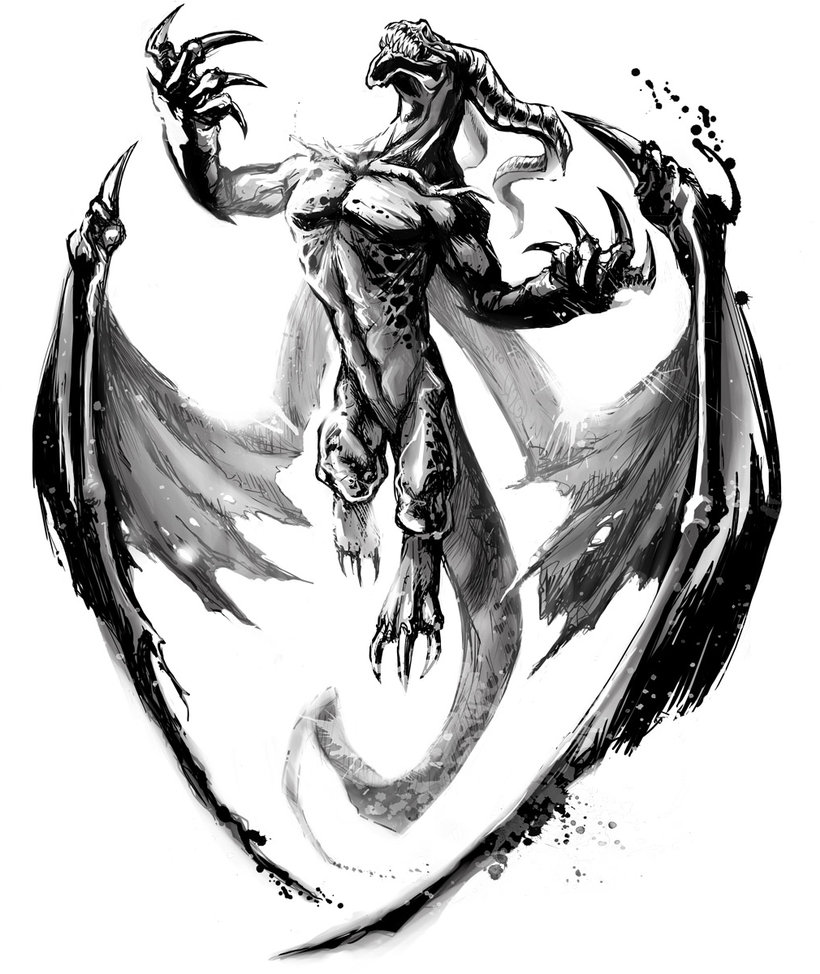

## Luis Sukys

  Hi There!
  Welcome to my Personal Repository.

<!-- Languages and tools. Check the  alignment.  Logos from: https://www.vectorlogo.zone or https://simpleicons.org/ -->

  <code></code>
  <code></code>
  <code></code>
  <code></code>
   
  <code></code>
  <code></code>
  <code></code>
  <code></code>
   
  <code></code>
  <code></code>
  <code></code>
  <code></code>
   
  <code></code>
  <code></code>
  <code></code>
  <code></code>
   
  <code></code>
  <code></code>
  <code></code>
  <code></code>
   
  <code></code>
  <code></code>
  <code></code>
  <code></code>
   

 

#### Actually Studying: 
   - Spring Security
   - Cryptography

  
  
   
   
   

